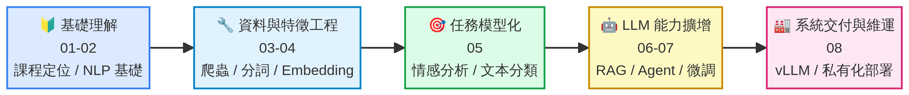
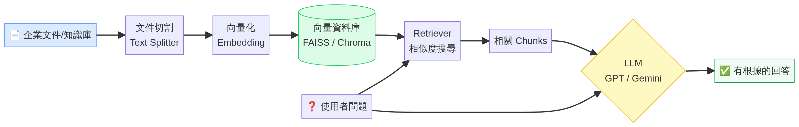
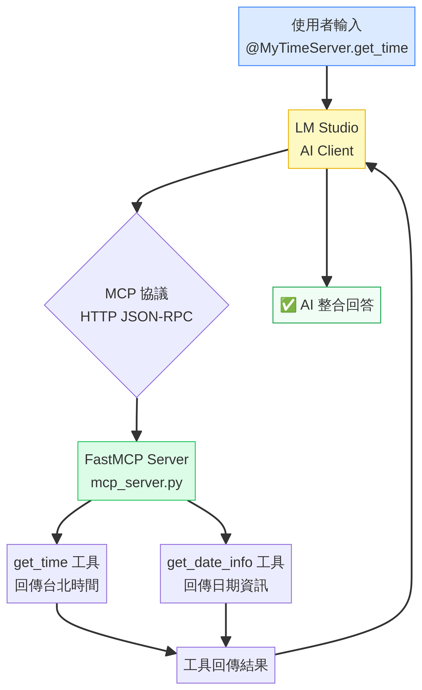
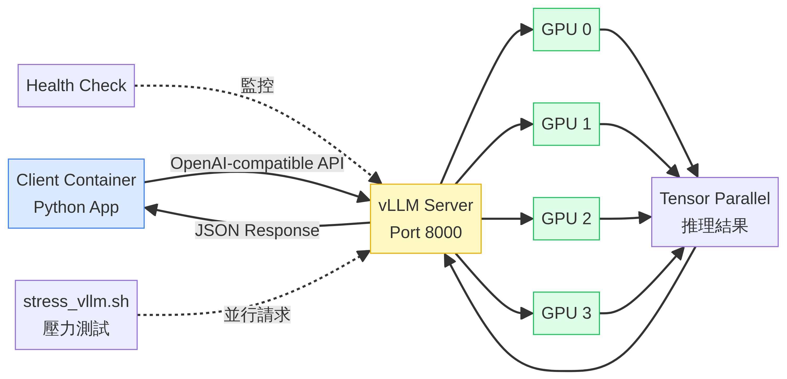

# 09 — 外訓心得：Python 中文 NLP 與 LLM 專家課程

> tags: #NLP #LLM #RAG #Agent #MCP #外訓 #心得 #completed
> 課程名稱：Python 中文自然語言 NLP 深度學習與大型語言 LLM 專家課程
> 訓練機構：恆逸資訊
> 受訓期間：2026/03/09 ~ 2026/03/16（四天）
> 原始講義：[PNLP上課筆記_2026-03-09.pdf](assets/PNLP上課筆記_2026-03-09.pdf)

---

## 課後心得報告基本資料

| 欄位 | 內容 |
| :--- | :--- |
| **姓名** | william0214 |
| **訓練機構** | 恆逸教育訓練中心 |
| **課程名稱** | Python 中文自然語言 NLP 深度學習與大型語言 LLM 專家課程 |
| **報告日期** | 2026/03/23 |
| **受訓期間** | 2026/03/09 ~ 2026/03/16（四天，共 28 小時） |

---

## 壹：課程內容大綱

### 第一章：課程大綱與定位

今年三月份，有幸參與了「Python 中文 NLP 與 LLM 專家課程」。這門課程的重點不僅僅是單點的工具教學，而是一條完整的企業 AI 落地路徑。課程內容主軸分為三層：首先是**中文 NLP 基礎**，包含爬蟲、分詞、Embedding、文本分類與情感分析；接著是 **LLM 應用**，涵蓋 Transformer、RAG、Assistants API、LangChain、LlamaIndex 與 Agent；最後是**企業部署**，探討開源模型微調、GGUF、vLLM 多 GPU 推理與私有化部署。

目前 AI 科技不斷進化，日新月異，深深感受到必須時時刻刻把眼睛耳朵打開，跟上世界技術發展的腳步。AI 的進化還在進行中，而我們的學習腳步也才正要開始。

| 階段 | 主題 | 課時 | 涵蓋 Lesson |
| :--- | :--- | :---: | :--- |
| 第一階段 | Python 爬蟲與資料集構建 | 0.5 hr | Lesson 3, 4 |
| 第一階段 | 自動化標註與文本分類 | 0.5 hr | Lesson 8 |
| 第一階段 | NLP 核心模型與演算法實務 | 1 hr | Lesson 9 |
| 第一階段 | 新聞/產業資訊分類系統建構 | 1 hr | Lesson 10 |
| 第一階段 | 情感分析模型訓練 | 2 hr | Lesson 11 |
| 第一階段 | 中文社群聆聽與詞雲分析 | 2 hr | Lesson 12, 15, 19 |
| 第二階段 | Transformer 與 Transfer Learning | 0.5 hr | Lesson 20, 21 |
| 第二階段 | OpenAI 模型 + LangChain RAG | 3 hr | Lesson 27-29, 33 |
| 第二階段 | Assistants API + LlamaIndex RAG | 2 hr | Lesson 30, 31, 35, 40 |
| 第二階段 | GPTs API 串接與 AI Agents 語境優化 | 2 hr | Lesson 50.1-50.3 |
| 第二階段 | 開源模型微調：LLaMA / Mistral / Gemma | 3 hr | Lesson 24, 25, 25.4 |
| 第二階段 | Graph Database RAG 強化知識推理 | 3 hr | Lesson 46.2, 51, 55, 56 |
| 第二階段 | LangChain + LangGraph 設計 AI Agent Tools | 3 hr | Lesson 43, 45, 57.1, 58 |
| 第二階段 | LLM GGUF 格式轉換與 CPU 推理部署 | 1.5 hr | Lesson 36 |
| 第二階段 | 離線私有化部署 + LangChain RAG | 3 hr | Lesson 34, 36 |
| Bonus | n8n 於 AI Agent 的應用 | — | — |

**課程學習路徑圖：**



---

### 第二章：資料採集與中文 NLP 基礎

在課程的初期，我們學習了如何透過 Python 進行資料採集與前處理。這部分涵蓋了使用 `urllib`、`requests` 與 `BeautifulSoup` 進行網頁爬蟲，甚至利用 Selenium 處理動態網頁，以及如何從 `ld+json` 結構化資料中建立訓練集。

接著，課程深入探討了中文分詞技術，特別是 `jieba` 與中研院的 CKIP Transformers。我們實作了詞袋模型（Bag of Words）、N-gram 以及 TF-IDF 模型，並利用 Bayes 分類法建立中文分類器。

**CKIP Transformers 效能基準（100 篇中文文章）：**

| 執行環境 | 執行緒數 | 耗時 | 預估 1000 篇 |
| :--- | :---: | :---: | :---: |
| CPU (5900x) | 1 thread | 140s | 133.3 hrs |
| CPU (5900x) | 4 threads | 41s | 39.0 hrs |
| CPU (5900x) | 24 threads | 27s | 25.7 hrs |
| GPU (RTX 3090) | — | 24s（1000篇） | 24s |

從上表可以明顯看出，GPU 的批次處理效能遠超 CPU，這對於企業大規模文本處理任務至關重要。

**CKIP Transformers 實體擷取實作範例：**

```python
# 來源：課程講義 CKIP Transformers 實作
# 用途：中文命名實體識別（NER）

import time
from ckip_transformers.nlp import CkipWordSegmenter, CkipPosTagger, CkipNerChunker

# 初始化模型（-1 為 CPU，0 為 GPU）
ws_driver = CkipWordSegmenter(device=-1)
pos_driver = CkipPosTagger(device=-1)
ner_driver = CkipNerChunker(device=-1)

def extract_entities(content):
    entities = {
        "PERSON": [], "ORG": [], "GPE": [], "PRODUCT": [],
        "EVENT": [], "DATE": [], "TIME": [], "MONEY": [],
    }
    ner_results = ner_driver([content])
    for result in ner_results[0]:
        text, label, idx = result
        if text.strip() not in entities.get(label, []):
            entities.get(label, []).append(text.strip())
    return entities

# 測試
content = "台灣蔡阿嘎和陳大衛在台北101逛誠品, 買了一個帆布包，接著去永康夜市吃牛肉麵和水餃"
entities = extract_entities(content)
print(entities)
# 輸出：{'PERSON': ['蔡阿嘎', '陳大衛'], 'GPE': ['台灣', '台北101', '永康夜市'], ...}
```

**jieba 支援的詞性對照表：**

| 詞性代碼 | 說明 |
| :--- | :--- |
| `n` | 名詞 |
| `v` | 動詞 |
| `adj` | 形容詞 |
| `adv` | 副詞 |
| `pron` | 代詞/代名詞 |
| `punc` | 標點符號 |
| `m` | 數詞（jieba 獨有） |


---

### 第三章：文本分類與情感分析

課程進一步引導我們進入文本分類與情感分析的領域。在文本分類方面，我們探討了 **Multi-Class**（多類別）與 **Multi-Label**（多標籤）分類的差異，並實作了基於 TF-IDF 與 SVM 的基準分類器。

| 分類類型 | 說明 | 範例 |
| :--- | :--- | :--- |
| **Multi-Class** | 一筆資料只屬於單一類別 | 垃圾郵件判斷、正/中/負情感三分類 |
| **Multi-Label** | 一筆資料可同時屬於多個類別 | 新聞多主題標註、電影多類型標註 |

在情感分析方面，我們學習了如何使用 SnowNLP 進行基礎情感分析，並透過 Naive Bayes 與 XGBoost 進行正負面情感分類。此外，我們也實作了基於 RNN（Recurrent Neural Networks）的情感分數預測，並使用 BERT 進行細粒度的五類情感分類。

**模型演進路徑：**

```python
# 課程中的模型選擇光譜
model_spectrum = {
    "traditional": ["Naive Bayes", "Logistic Regression", "SVM", "XGBoost"],
    "deep_learning": ["RNN / LSTM", "BERT / Transformer"],
}
# 實務原則：先用 TF-IDF + 傳統分類器做 baseline，再導入深度模型提升效果
```

**載入大衛的中文情感模型（Hugging Face）：**

```python
# 來源：課程講義 Lesson 22 LAB
# 用途：使用預訓練的中文情感分析模型進行五類情感預測

import torch
from transformers import BertForSequenceClassification, BertTokenizer

# 下載大衛的模型（DavidLanz/fine_tune_chinese_sentiment）
tokenizer = BertTokenizer.from_pretrained('DavidLanz/fine_tune_chinese_sentiment')
model = BertForSequenceClassification.from_pretrained('DavidLanz/fine_tune_chinese_sentiment')

# 五類情感標籤
class_label = {
    0: 'Semi-negation',  # 半負面
    1: 'Negation',       # 負面
    2: 'Neutral',        # 中立
    3: 'Semi-positive',  # 半正面
    4: 'Positive',       # 正面
}

def predict_sentiment(model, tokenizer, sentence):
    input_ids = torch.tensor([tokenizer.encode(sentence)])
    with torch.no_grad():
        out = model(input_ids)
        pred_list = out.logits.softmax(dim=-1).tolist()
    top_idx = pred_list[0].index(max(pred_list[0]))
    return class_label[top_idx], pred_list[0]

# 測試
text = '阿不就好棒棒'
predict, scores = predict_sentiment(model, tokenizer, text)
print(f"預測結果：{predict}")  # 輸出：Positive
```

---

### 第四章：RAG 架構與 LLM 應用

隨著課程的推進，我們進入了大型語言模型（LLM）的應用階段。這部分是課程的核心之一，我們學習了如何結合 OpenAI 模型與 LangChain 建立 RAG（Retrieval-Augmented Generation）系統。

透過 RAG 架構，我們可以讓 LLM 根據特定的知識庫回答問題，有效解決了 LLM 產生**幻覺（Hallucination）**的問題。

**RAG 核心流程圖：**



RAG 的完整流程可分為兩個階段：

**索引階段（Indexing）：**
1. 載入企業文件（PDF、Word、網頁等）
2. 使用 Text Splitter 進行文件切割（含 overlap 設定）
3. 透過 Embedding 模型將文字轉為向量
4. 儲存至向量資料庫（FAISS / Chroma）

**查詢階段（Querying）：**
1. 使用者輸入問題
2. Retriever 進行相似度搜尋，找出相關 Chunks
3. 將問題 + 相關 Chunks 組合成 Prompt
4. 交由 LLM（GPT / Gemini）生成有根據的回答

**LangChain RAG 實作骨架：**

```python
# 來源：課程講義 Lesson 29, 33, 34
# 用途：建立 LangChain RAG Pipeline

from langchain.text_splitter import RecursiveCharacterTextSplitter
from langchain_openai import OpenAIEmbeddings, ChatOpenAI
from langchain_community.vectorstores import FAISS
from langchain.chains import RetrievalQA
from langchain_core.prompts import ChatPromptTemplate

# 1. 文件切割
text_splitter = RecursiveCharacterTextSplitter(
    chunk_size=500,
    chunk_overlap=50
)

# 2. 建立向量資料庫
embeddings = OpenAIEmbeddings()
vectorstore = FAISS.from_documents(docs, embeddings)

# 3. 設定 RAG Prompt（防止幻覺）
prompt = ChatPromptTemplate.from_messages([
    ("system", "你只能根據提供的知識內容回答，若資料不足請明說。"),
    ("human", "問題：{question}\n\n參考資料：{context}"),
])

# 4. 建立 RetrievalQA Chain
qa_chain = RetrievalQA.from_chain_type(
    llm=ChatOpenAI(model="gpt-4o-mini"),
    retriever=vectorstore.as_retriever(search_kwargs={"k": 3}),
    chain_type_kwargs={"prompt": prompt}
)

# 5. 查詢
result = qa_chain.invoke({"query": "請說明公司的請假政策"})
print(result["result"])
```

課程中也介紹了 **LlamaIndex** 作為 RAG 的另一個選擇，特別適合資料索引與 Query Engine 的建立。此外，我們還學習了 **LlamaIndex Splitter** 的不同分片策略比較，以及如何使用 Assistants API 搭配 YouTube 字幕進行知識問答。

---

### 第五章：確保 LLM 回覆格式

由於 LLM 回答的資料是比較自由沒有結構化的資料，而其實在對談機器人後段我們還是需要他是標準化或是制式化的資料格式以方便我們於後段進行處理甚至傳送給其他服務使用，因此課程中介紹了如何確保 LLM 回傳 JSON 格式。

**兩種確保格式的方法：**

| 方法 | 說明 | 適用場景 |
| :--- | :--- | :--- |
| **Function Calling** | 在 API 中描述函式的簽章（名稱、描述、參數必填項）。AI 發現資訊不全會主動追問，直到蒐齊資訊並輸出 JSON。 | 需要 AI 主動蒐集資訊的場景 |
| **JSON Mode** | 設定 `response_format: { "type": "json_object" }`。強制模型移除所有解釋性文字，僅回傳符合語法的 JSON 物件。 | 需要嚴格格式化輸出的場景 |

**Function Calling 實作範例：**

```python
# 來源：課程講義 OpenAI Function Calling
# 用途：確保 LLM 以結構化 JSON 格式回傳員工請假資訊

import json
from openai import OpenAI

client = OpenAI()

# 定義函式簽章
tools = [{
    "type": "function",
    "function": {
        "name": "submit_leave_request",
        "description": "提交員工請假申請",
        "parameters": {
            "type": "object",
            "properties": {
                "employee_name": {"type": "string", "description": "員工姓名"},
                "leave_type": {"type": "string", "enum": ["年假", "病假", "事假"]},
                "start_date": {"type": "string", "description": "請假開始日期 (YYYY-MM-DD)"},
                "end_date": {"type": "string", "description": "請假結束日期 (YYYY-MM-DD)"},
                "reason": {"type": "string", "description": "請假原因"}
            },
            "required": ["employee_name", "leave_type", "start_date", "end_date"]
        }
    }
}]

response = client.chat.completions.create(
    model="gpt-4o-mini",
    messages=[
        {"role": "system", "content": "你是一個員工請假系統助手"},
        {"role": "user", "content": "我是王小明，我想請明天的年假"}
    ],
    tools=tools,
    tool_choice="auto"
)

# AI 發現缺少 end_date，會主動追問
print(response.choices[0].message.content)
```

---

### 第六章：開源模型微調（Fine-tuning）

課程的重要章節之一是開源模型的微調。我們學習了如何微調 GPT-2 模型以進行文本生成，並探討了 LLaMA、Mistral 與 Gemma 等開源模型的微調技術。

**微調 vs. RAG 的選擇策略：**

| 比較維度 | RAG | Fine-tuning |
| :--- | :--- | :--- |
| **知識更新** | 即時，只需更新向量庫 | 需要重新訓練 |
| **成本** | 低（推理成本） | 高（訓練 GPU 成本） |
| **適用場景** | 企業知識庫問答、文件查詢 | 特定語氣/風格、專業術語強化 |
| **可解釋性** | 高（可追溯來源） | 低（黑盒子） |

**QLoRA 微調 LLaMA 3.2 3B 流程：**

```python
# 來源：課程講義 Lesson 25.4
# 用途：使用 QLoRA 微調 Llama 3.2 3B 模型

# 步驟 1：在 HuggingFace 建立兩個模型倉庫
# - llama3.2_3B_news_qlora  (存放 LoRA Adapter)
# - llama3.2_3B_news_merged (存放合併後的完整模型)

# 步驟 2：使用 Colab Pro 進行 QLoRA 微調
# 來源：https://colab.research.google.com/drive/12kj4G6qy-jq58GKYcprWQ4BmkV33k6xq

# 步驟 3：合併 QLoRA Adapter 並轉為 GGUF 格式
# GGUF 量化類型說明：
# Q4_K_M：4-bit 量化，每個權重使用 4.5 bpw，品質與速度的最佳平衡點
# Q8_0：8-bit 量化，品質最高但檔案最大
# Q2_K：2-bit 量化，檔案最小但品質損失最大

# 步驟 4：上傳至 HuggingFace
from huggingface_hub import HfApi
api = HfApi()
api.upload_folder(
    folder_path="./llama3.2_3B_news_merged",
    repo_id="your_username/llama3.2_3B_news_merged",
    repo_type="model"
)
```

**OpenAI Fine-tuning 客服機器人（使用石頭科技訓練集）：**

```python
# 來源：課程講義 Lesson 24
# 用途：使用 JSONL 格式的 QA 訓練集微調 OpenAI 模型

# 訓練資料格式（JSONL）
training_example = {
    "messages": [
        {"role": "system", "content": "您現在扮演石頭科技公司的客服人員"},
        {"role": "user", "content": "如何登入ROCK主控台?"},
        {"role": "assistant", "content": "進入ROCK網頁(https://dashboard.asurock.com/)，點選左上方的按鈕進入登入頁面，輸入帳號密碼後登入。"}
    ]
}

# 上傳訓練檔案並建立 Fine-tuning Job
import openai
client = openai.OpenAI()

# 上傳訓練資料
with open("training_data.jsonl", "rb") as f:
    response = client.files.create(file=f, purpose="fine-tune")
file_id = response.id

# 建立微調任務
job = client.fine_tuning.jobs.create(
    training_file=file_id,
    model="gpt-4o-mini-2024-07-18"
)
print(f"Fine-tuning Job ID: {job.id}")
```

---

### 第七章：AI Agent 與 LangGraph

課程的高階主題是 AI Agent 的設計與實作。我們學習了如何使用 LangChain 與 LangGraph 建立具有工具呼叫能力的 AI Agent。

**LangChain vs. LlamaIndex vs. LangGraph 分工：**

| 框架 | 定位 | 主要用途 |
| :--- | :--- | :--- |
| **LangChain** | 流程編排 | Chains、Agents、Tools、Workflow |
| **LlamaIndex** | 資料索引 | Index、Retriever、Query Engine |
| **LangGraph** | 狀態流控制 | 多步驟流程、節點式任務編排 |

**LangGraph AI Agent 實作（含工具呼叫）：**

```python
# 來源：課程講義 Lesson 50.2
# 用途：使用 LangGraph 建立具有 route_tools 決策節點的 AI Agent

from langgraph.graph import StateGraph, END
from langgraph.prebuilt import ToolNode
from langchain_core.tools import tool
from langchain_openai import ChatOpenAI

# 定義工具
@tool
def get_weather(city: str) -> str:
    """取得指定城市的天氣資訊"""
    # 實際應用中會呼叫天氣 API
    return f"{city} 今天天氣晴朗，氣溫 25°C"

@tool
def get_news(topic: str) -> str:
    """取得指定主題的最新新聞"""
    return f"關於 {topic} 的最新新聞：..."

tools = [get_weather, get_news]
llm = ChatOpenAI(model="gpt-4o-mini").bind_tools(tools)

# 建立 LangGraph 狀態圖
def route_tools(state):
    """決策節點：判斷是否需要呼叫工具"""
    last_message = state["messages"][-1]
    if hasattr(last_message, "tool_calls") and last_message.tool_calls:
        return "tools"
    return END

graph = StateGraph(dict)
graph.add_node("agent", lambda state: {"messages": [llm.invoke(state["messages"])]})
graph.add_node("tools", ToolNode(tools))
graph.set_entry_point("agent")
graph.add_conditional_edges("agent", route_tools)
graph.add_edge("tools", "agent")

app = graph.compile()

# 執行 Agent
result = app.invoke({"messages": [{"role": "user", "content": "台北和高雄今天天氣如何？"}]})
```

此外，課程也介紹了如何使用 LLM 將非結構化資料轉換為**知識圖譜**（Knowledge Graph），並透過 Neo4j 進行儲存與查詢。這種 Graph RAG 的方式能夠強化 AI 的知識推理能力，特別適合處理複雜的關聯性資料。

---

### 第八章：MCP 協議與企業私有化部署

課程的最後階段聚焦於兩個重要主題：MCP 協議與企業私有化部署。

#### 8.1 MCP（Model Context Protocol）

MCP 是由 Anthropic 提出的開放標準協議，旨在標準化 AI Client 與外部工具/資料之間的通訊介面。

**MCP 架構圖：**



**MCP Server 實作範例（取得台北時間）：**

```python
# 來源：課程講義 MCP Server 實作
# 用途：建立一個提供時間工具的 MCP Server

# 安裝：pip install --upgrade fastmcp
# 建立：C:\mcp\mcp_server.py

from fastmcp import FastMCP

mcp = FastMCP(name="MyTimeServer")

@mcp.tool
def get_time() -> str:
    """取得目前台北時間"""
    from datetime import datetime
    from zoneinfo import ZoneInfo
    return datetime.now(ZoneInfo("Asia/Taipei")).strftime("%Y-%m-%d %H:%M:%S")

@mcp.tool
def get_date_info(format: str = "iso") -> str:
    """取得日期資訊，支援 iso / readable / timestamp 格式"""
    from datetime import datetime
    from zoneinfo import ZoneInfo
    now = datetime.now(ZoneInfo("Asia/Taipei"))
    if format == "readable":
        return now.strftime("%Y年%m月%d日 %H:%M:%S (%A)")
    elif format == "timestamp":
        return str(int(now.timestamp()))
    return now.isoformat()

if __name__ == "__main__":
    mcp.run(transport="http", host="127.0.0.1", port=8000, path="/")
```

**在 LM Studio 中整合 MCP Server：**

```json
// 在 LM Studio 的 mcp.json 中加入以下設定
{
  "mcpServers": {
    "MyTimeServer": {
      "url": "http://localhost:8000"
    }
  }
}
```

設定完成後，在 LM Studio 聊天框中輸入 `@MyTimeServer.get_time()` 即可呼叫工具，讓 AI 能夠取得即時的時間資訊。

#### 8.2 企業私有化部署（vLLM 多 GPU）

對於需要高效能推理的企業場景，課程介紹了使用 vLLM 進行多 GPU 部署的方案。

**vLLM 多 GPU 部署架構圖：**



**vLLM Docker Compose 部署設定：**

```yaml
# 來源：課程講義 vLLM 多 GPU 部署
# 用途：使用 Docker 部署 vLLM 服務，支援 4 張 GPU 並行推理

services:
  vllm:
    image: vllm/vllm-openai:v0.11.0
    command: >
      --model taide/Gemma-3-TAIDE-12b-Chat
      --tensor-parallel-size 4        # 4 張 GPU 並行
      --gpu-memory-utilization 0.92
      --max-model-len 8192
      --served-model-name Gemma-3-TAIDE-12b-Chat
    ports:
      - "8000:8000"
    restart: unless-stopped
    gpus: all
```

**vLLM 壓力測試腳本：**

```bash
# 來源：課程講義 stress_vllm.sh
# 用途：測試 vLLM 服務的並行處理能力

#!/bin/bash
URL="http://localhost:8000/v1/chat/completions"
MODEL="Gemma-3-TAIDE-12b-Chat"
CONCURRENCY=${1:-8}  # 預設 8 並行

for i in $(seq 1 $CONCURRENCY); do
  (
    curl -s -o /dev/null -w "[$i] 回應時間：%{time_total}s\n" \
      -H "Content-Type: application/json" \
      -d "{\"model\":\"$MODEL\",\"messages\":[{\"role\":\"user\",\"content\":\"請用中文寫一段內容 第 $i 個請求\"}],\"max_tokens\":256}" \
      "$URL"
  ) &
done
wait
```

**RAG vs. MCP 比較：**

| 比較維度 | RAG | MCP |
| :--- | :--- | :--- |
| **核心目的** | 解決 AI 幻覺，讓回覆有據可查 | 標準化 AI 與工具/資料的通訊介面 |
| **資料來源** | 靜態文件、知識庫 | 動態工具、即時資料、外部 API |
| **實作複雜度** | 中（需建立向量庫） | 低（標準化協議） |
| **適用場景** | 企業知識庫問答 | AI 呼叫外部工具、即時資料查詢 |

---

## 貳：心得報告

AI 科技的進化已然顛覆了工程師的既有工作模式。本次課程讓我有機會深入探索 Python 中文 NLP 技術、OpenAI API 與 RAG 等嶄新架構。雖然 AI 提供了大幅提升效率的契機，但「管理 AI」的挑戰也隨之而來。

如同引導一位高智商的下屬，我們必須學會如何精確傳遞需求（Prompting）與建構框架（Architecture）。如何將 AI 的潛力轉化為實質的績效，並在公司內部建立高效的 AI 協作模式（例如透過 RAG 建立企業專屬知識庫），將是我下一階段研究摸索與實踐的方向。

**未來應用規劃：**

| 應用方向 | 技術選型 | 預期效益 |
| :--- | :--- | :--- |
| 企業知識庫問答系統 | LangChain + RAG + FAISS | 降低重複性查詢成本，提升知識傳遞效率 |
| 文件自動分類系統 | TF-IDF + SVM / BERT | 自動化文件管理，減少人工分類時間 |
| 私有化 LLM 部署 | GGUF + LM Studio | 保護企業資料隱私，降低 API 費用 |
| AI Agent 工作流 | LangGraph + MCP | 自動化重複性業務流程 |

目前 AI 科技不斷進化，日新月異，深深感受到必須時時刻刻把眼睛耳朵打開，跟上世界技術發展的腳步。AI 的進化還在進行中，而我們的學習腳步也才正要開始。

---

| 派訓單位審核意見 | 評分 |
| :--- | :--- |
| 1. 報告架構完整 (佔 25%) | |
| 2. 內容陳述簡明有條 (佔 25%) | |
| 3. 對所負責業務實用的程度 (佔 25%) | |
| 4. 報告可供參考之價值 (佔 25%) | |
| **總分** | |

---

## 參考資源

- [LangChain 官方文件](https://python.langchain.com/)
- [LlamaIndex 官方文件](https://docs.llamaindex.ai/)
- [LangGraph 官方文件](https://langchain-ai.github.io/langgraph/)
- [Model Context Protocol](https://modelcontextprotocol.io/)
- [vLLM 官方文件](https://docs.vllm.ai/)
- [CKIP Transformers](https://github.com/ckiplab/ckip-transformers)
- [DavidLanz HuggingFace](https://huggingface.co/DavidLanz)
- [RAG 論文：Lewis et al. 2020](https://arxiv.org/abs/2005.11401)

---

> [⬅️ 上一篇：08_企業部署](08_企業部署.md) | 無（最後一篇）
