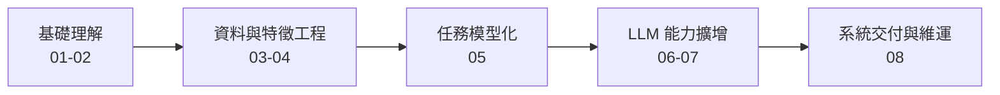
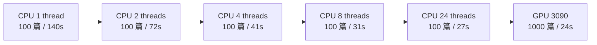
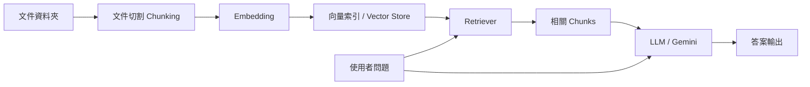
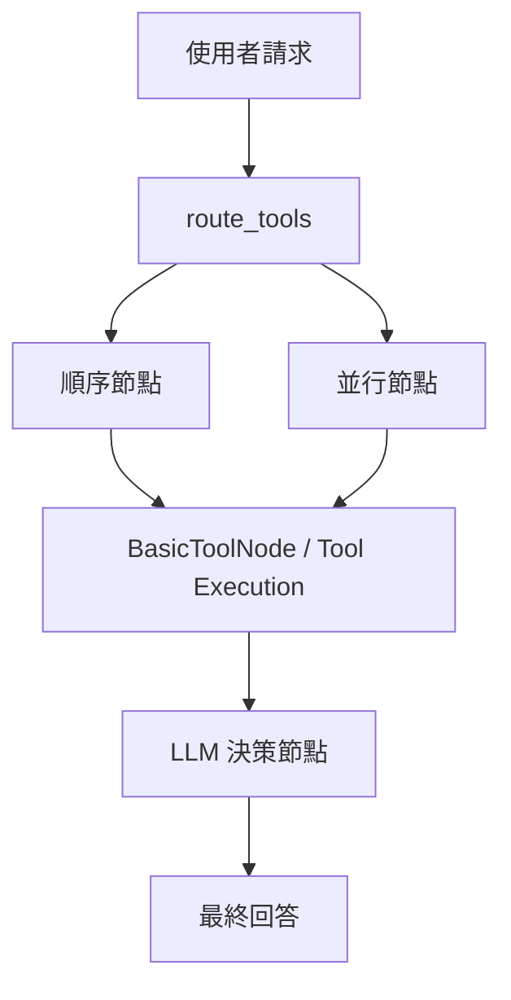
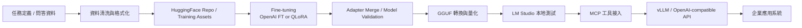
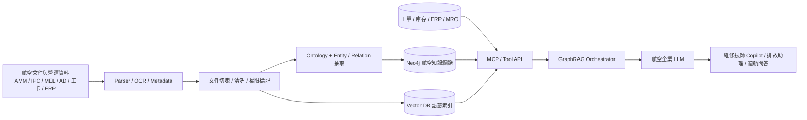

# 外訓心得 — 航空企業 LLM 版

> tags: #外訓 #心得 #NLP #LLM #Aviation #KnowledgeGraph #in-progress
> 課程名稱：Python 中文自然語言 NLP 深度學習與大型語言 LLM 專家課程
> 訓練期間：2026/03/09 ~ 2026/03/12（四天）
> 訓練機構：恆逸資訊
> 整理日期：2026/04/15
> 說明：此版保留原課程心得架構，並加入航空企業知識圖譜與 LLM 落地藍圖。

---

## 參訓目的

- 盤點中文 NLP、LLM、RAG、Agent 與企業部署之間的技術關係，建立較完整的能力地圖。
- 補齊從資料採集、前處理、文本分類、情感分析到模型服務化的實務脈絡，作為後續內部 PoC 的參考。
- 了解繁體中文處理工具、微調路線與地端部署選項，評估是否可落地到知識管理、客服與文本分析等場景。

---

## 課程圖示摘要

### 課程學習地圖

> 圖表來源：[course_learning_map.md](diagrams/course_learning_map.md)

### 中文分詞效能判讀

> 圖表來源：[ckip_benchmark.md](diagrams/ckip_benchmark.md)

### RAG 與 Agent 流程

> 圖表來源：[rag_agent_mcp_flows.md](diagrams/rag_agent_mcp_flows.md)

### 微調到部署路線

> 圖表來源：[llm_delivery_roadmap.md](diagrams/llm_delivery_roadmap.md)

---

## 課程重點摘要

### Day 1 重點摘要

- 課程一開始先建立整體學習路線，明確說明這不是單點工具教學，而是從資料、模型、應用到部署的一條完整企業 AI 落地流程。
- 在資料採集與前處理部分，重新整理了 `requests`、`BeautifulSoup`、`Selenium` 的使用情境，也理解 `ld+json` 這類結構化欄位對建立訓練集的實際價值。
- NLP 基礎章節讓我再次確認，企業文本任務不應直接跳到大型模型，仍應先用 `TF-IDF + Naive Bayes / SVM` 等 baseline 建立可比較、可解釋、可快速驗證的起點。
- 透過 Multi-Class 與 Multi-Label 的問題定義，對標註方式、模型輸出形式與後續評估指標之間的關係有更清楚的理解。

### Day 2 重點摘要

- 第二天的核心收穫是更具體理解中文 NLP 與英文處理流程的差異，尤其中文分詞品質會直接影響後續的 TF-IDF、分類、情感分析與知識檢索效果。
- 課堂實際比較 Jieba 與 CKIP Transformers 的定位，讓我知道快速 baseline 與繁體中文高品質處理其實是兩種不同需求，工具選型應依場景決定。
- 在 Embedding 部分，課程把 N-Gram、TF-IDF、Word2Vec 放在同一條脈絡上說明，幫助我更清楚區分稀疏特徵與 dense embedding 各自適用的分析任務。
- CKIP 效能測試也提供了很有價值的工程判斷依據，讓我理解若未來要處理大量繁體中文文件，GPU 與批次處理管線設計會是必要考量。

### Day 3 重點摘要

- 第三天主要聚焦在情感分析與細粒度文本分類。課程從 SnowNLP、AFINN、Naive Bayes、RNN 一路帶到 BERT Fine-Tuning，完整呈現從 baseline 到高表現模型的實務演進。
- 透過 Google Play 評論資料集與現成 HuggingFace 模型案例，我更具體理解 supervised text classification 的標準流程，包括資料切分、tokenization、模型訓練、驗證與未見資料評估。
- 除了模型本身，課程也把文章分類、廣告投放、輿情監控、摘要、關鍵詞與 Dashboard 串接在一起，讓我看到 NLP 成果如何轉為實際的商業標籤與決策資訊。
- 這一天最重要的體會是，模型效果只是起點，真正能被組織採用的成果必須進一步 API 化、儀表板化，並能融入現有工作流程。

### Day 4 重點摘要

- 第四天是整門課最接近目前企業生成式 AI 實務的一天。課程系統性整理了 RAG 的切塊、Embedding、索引、檢索與生成流程，也說明了 Grounding、引用與拒答機制的重要性。
- 對 LangChain、LlamaIndex、LangGraph、Agent 與 MCP 的角色分工有更清楚的認識，理解模型本身只是核心元件之一，真正的落地挑戰在於工具整合、工作流編排與狀態管理。
- 在微調部分，課程清楚區分了 RAG 與 Fine-Tuning 的用途差異，也介紹了 QLoRA、4-bit 量化、Adapter Merge 與 HuggingFace 發布流程，讓我對低成本客製化開源模型有更實際的概念。
- 最後延伸到 GGUF、LM Studio、vLLM、多 GPU Serving 與 MLOps，讓我理解企業最終交付的不是單一 notebook，而是一套可部署、可監控、可維運的服務系統。

---

## 學習收穫

- 這次外訓最大的價值，不是單一模型或單一工具，而是幫助我重新建立從資料採集、前處理、中文分詞、向量化、文本分類、RAG、微調到部署的完整技術地圖。
- 我更能區分傳統 NLP、深度學習模型與 LLM 路線各自適用的場景，知道不是所有問題都應直接用大型模型處理，而是要依資料穩定度、知識更新頻率、可解釋性與部署成本做取捨。
- 對繁體中文處理工具鏈有更明確的認識，包含 Jieba、CKIP Transformers、中文 BERT 模型與 HuggingFace 生態，這些都可作為後續內部實驗與 PoC 的技術基礎。
- 課程也讓我更重視 hallucination control、source grounding、引用機制、模型治理與服務監控等議題，理解企業導入生成式 AI 的難點不只在模型能力，更在系統可靠性與治理能力。
- 透過案例與 Lab 的搭配，我對「能不能做」與「要怎麼做成可交付系統」之間的差異有更實際的感受，這對後續規劃專案切入點很有幫助。

## 航空領域落地藍圖

若要把這次課程內容轉成真正可落地的企業方案，我認為最具體的方向，是建立一套以航空專業知識為核心的企業 LLM。其核心不是只把文件丟進向量資料庫，而是先把維修手冊、適航公告、工卡、維修紀錄、料件資料與 SOP 建成可查詢的知識圖譜，再把圖譜、向量檢索與結構化資料查詢封裝成可由 LLM 呼叫的工具層。

- 第一層是資料治理，需先把航空文件依機型、ATA 章節、零件料號、故障碼、程序版本與適用條件做結構化整理。
- 第二層是知識底座，同時建立 Neo4j 知識圖譜與 Vector DB，前者負責關係推理，後者負責語意檢索。
- 第三層是工具化，把 Cypher 查詢、向量檢索、工單與庫存查詢封裝成 MCP 或 Tool API，讓 LLM 不是靠記憶回答，而是靠受控工具取用知識。
- 第四層才是模型層，若未來需要固定輸出格式、故障摘要模板或維修建議模板，再考慮做航空領域 adapter 或 fine-tuning。
- 最終交付應是具備引用來源、權限控制、風險提示與人工覆核機制的航空企業 LLM，而不是一般聊天機器人。

> 延伸圖表：[aviation_enterprise_llm_flow.md](diagrams/aviation_enterprise_llm_flow.md)

## 未來應用規劃

- 短期內可先鎖定一個航空子場景，例如維修手冊問答、ATA 章節查詢或適航公告檢索，避免一開始就把所有知識來源一次納入。
- 第一階段應先完成文件解析、欄位標準化與航空 ontology 設計，至少把 Aircraft、ATA、Part、Fault、Procedure、Regulation 幾類核心實體定義清楚。
- 第二階段再建立 GraphRAG 架構，把 Neo4j 圖譜查詢、向量檢索與工單或庫存資料查詢封裝成 LLM 可調用的工具。
- 第三階段才評估是否需要對模型做航空領域 fine-tuning；若需求主要是知識查詢與程序引用，優先順序仍應是資料品質、圖譜完整度與工具調用能力。
- 最後部署時，必須補上權限分級、審計日誌、引用來源、回覆信心分數與人工覆核節點，才能成為可在航空場域使用的企業級系統。

## 整體心得

本次課程的內容涵蓋面很廣，但不是零散地介紹新名詞，而是把中文 NLP、LLM、RAG、Agent 與企業部署串成一條相對完整的落地路線。對我而言，最大的收穫是把過去較分散的技術點重新整合成可執行的實務框架，也更清楚後續若要在工作中推動相關應用，應該從資料、任務與交付方式三個層面同步規劃，而不是只從模型本身出發。

> 備註：本版已完成內容整理，可於後續取得公司外訓心得模板後再做版型調整。