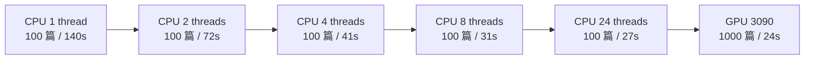
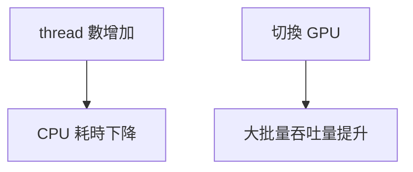

# CKIP Benchmark Diagram

```mermaid
flowchart LR
    A[CPU 1 thread\n100 篇 / 140s] --> B[CPU 2 threads\n100 篇 / 72s]
    B --> C[CPU 4 threads\n100 篇 / 41s]
    C --> D[CPU 8 threads\n100 篇 / 31s]
    D --> E[CPU 24 threads\n100 篇 / 27s]
    E --> F[GPU 3090\n1000 篇 / 24s]
```

```mermaid
flowchart TD
    A[thread 數增加] --> B[CPU 耗時下降]
    C[切換 GPU] --> D[大批量吞吐量提升]
```