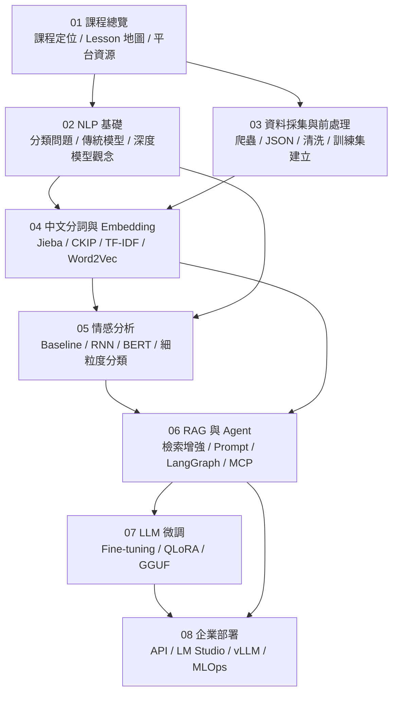
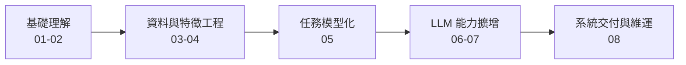
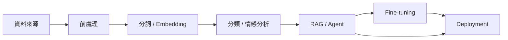

# Course Learning Map

## 01-08 Learning Map

## Learning Stages

## Concept Dependency View

說明：
- 第一張圖用章節檔案當節點，表示知識庫閱讀順序與依賴關係。
- 第二張圖把 01-08 壓成五個學習階段，方便從課程節奏理解全貌。
- 第三張圖則抽象成概念依賴鏈，方便之後延伸到別的課程或專案。