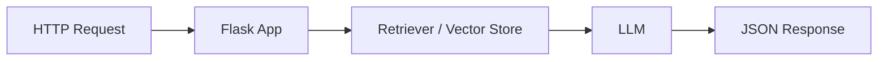
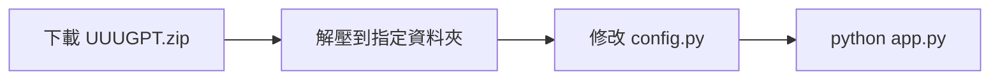
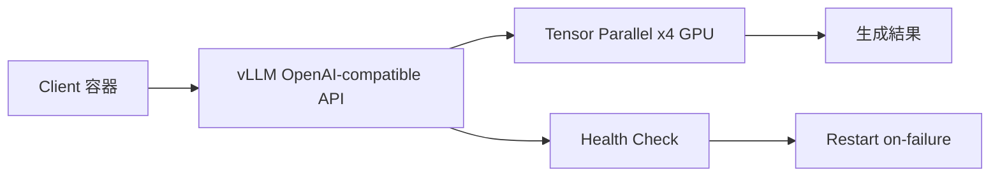
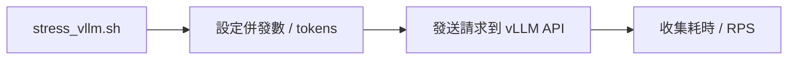

# Deployment Flows

## Flask RAG Service

```mermaid
flowchart LR
    A[HTTP Request] --> B[Flask App]
    B --> C[Retriever / Vector Store]
    C --> D[LLM]
    D --> E[JSON Response]
```

## UUUGPT Setup

```mermaid
flowchart LR
    A[下載 UUUGPT.zip] --> B[解壓到指定資料夾]
    B --> C[修改 config.py]
    C --> D[python app.py]
```

## vLLM Multi-GPU Serving

```mermaid
flowchart LR
    A[Client 容器] --> B[vLLM OpenAI-compatible API]
    B --> C[Tensor Parallel x4 GPU]
    C --> D[生成結果]
    B --> E[Health Check]
    E --> F[Restart on-failure]
```

## vLLM Stress Test

```mermaid
flowchart LR
    A[stress_vllm.sh] --> B[設定併發數 / tokens]
    B --> C[發送請求到 vLLM API]
    C --> D[收集耗時 / RPS]
```