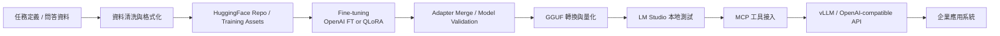
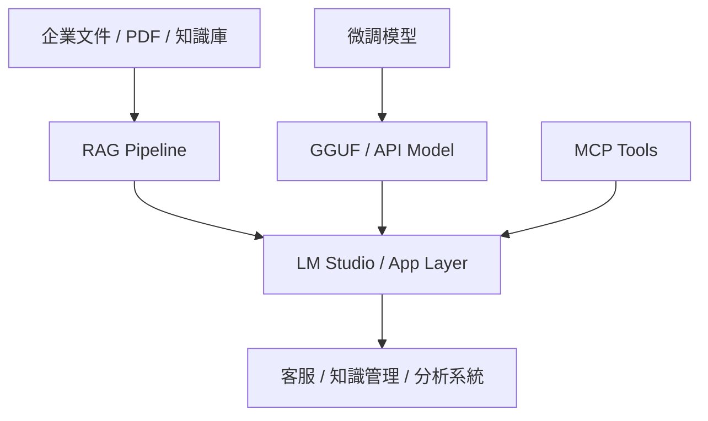
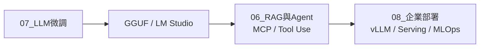

# LLM Delivery Roadmap

## Fine-tuning to Deployment Roadmap

## Knowledge and Serving Split

## Stage Mapping

說明：
- 第一張圖是單一路徑，強調從資料準備到可部署模型的工程順序。
- 第二張圖是雙軌架構，強調「知識補強」與「模型能力」在應用層匯合。
- 第三張圖把知識庫筆記章節直接映射到技術交付階段。