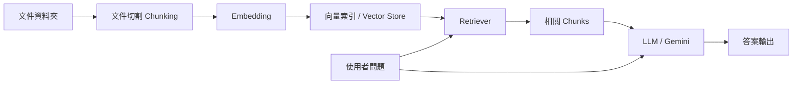
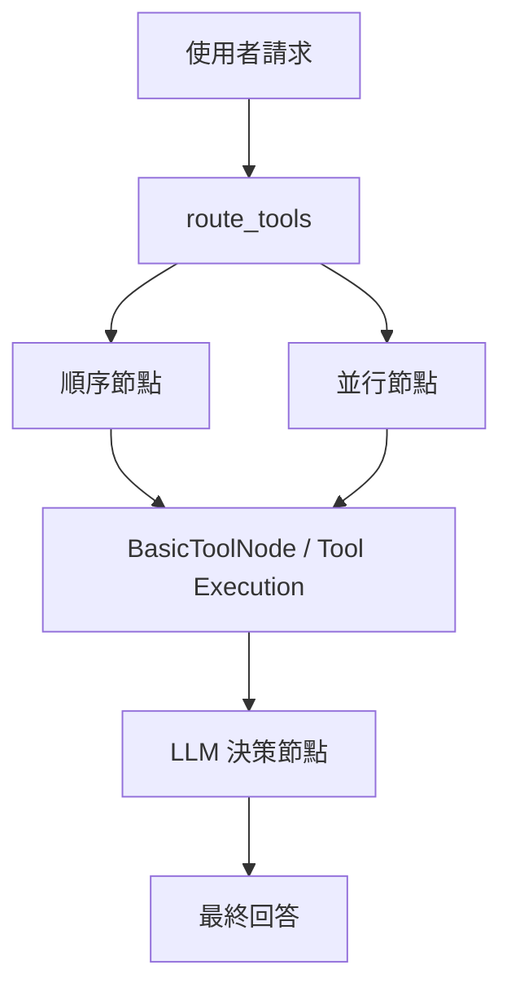
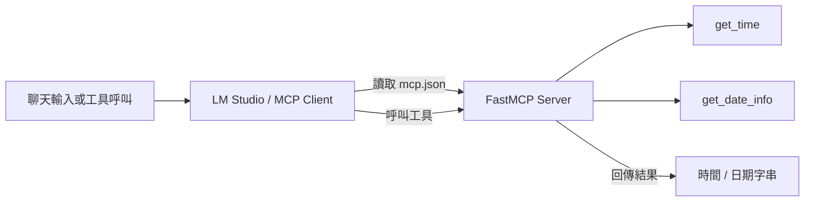

# RAG, Agent, MCP Flows

## RAG Pipeline

```mermaid
flowchart LR
    A[文件資料夾] --> B[文件切割 Chunking]
    B --> C[Embedding]
    C --> D[向量索引 / Vector Store]
    Q[使用者問題] --> E[Retriever]
    D --> E
    E --> F[相關 Chunks]
    F --> G[LLM / Gemini]
    Q --> G
    G --> H[答案輸出]
```

## LangGraph Agent Flow

```mermaid
flowchart TD
    U[使用者請求] --> R[route_tools]
    R --> S[順序節點]
    R --> P[並行節點]
    S --> T[BasicToolNode / Tool Execution]
    P --> T
    T --> L[LLM 決策節點]
    L --> O[最終回答]
```

## MCP Integration Flow

```mermaid
flowchart LR
    A[FastMCP Server] --> B[get_time]
    A --> C[get_date_info]
    D[LM Studio / MCP Client] -->|讀取 mcp.json| A
    E[聊天輸入或工具呼叫] --> D
    D -->|呼叫工具| A
    A -->|回傳結果| F[時間 / 日期字串]
```