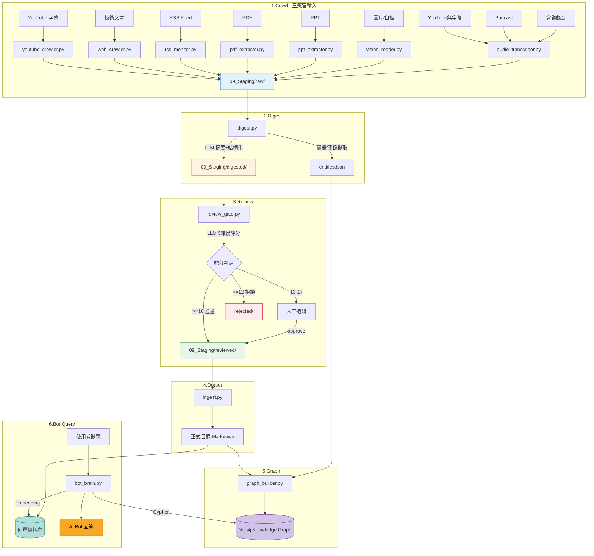

# Knowledge Pipeline v3 — 全感官知識管線架構設計

> tags: #Architecture #Pipeline #Automation #KnowledgeGraph

## 概述

Knowledge Pipeline 是一套**六階段**的全感官知識自動化流水線。具備**讀 (Read)**、**看 (Vision)**、**聽 (Audio)** 三種感官輸入能力，搭配 **Neo4j 知識圖譜**和**向量檢索**，最終驅動個人 AI Bot。

## 系統全貌



---

## 六階段說明

### Stage 1 爬 (Crawl) — 三感官輸入

**讀 Read**

| 模組 | 來源 | 技術 | 成本 |
|---|---|---|---|
| `youtube_crawler.py` | YouTube 字幕 + metadata | `yt-dlp` | 免費 |
| `web_crawler.py` | 技術部落格、文章 | `httpx` + `BeautifulSoup` | 免費 |
| `rss_monitor.py` | RSS Feed 訂閱 | `feedparser` | 免費 |

**看 Vision**

| 模組 | 來源 | 技術 | 成本 |
|---|---|---|---|
| `pdf_extractor.py` | PDF (文字型 + 掃描型) | `PyMuPDF` + `PaddleOCR` fallback | 免費 |
| `ppt_extractor.py` | PPT/PPTX 簡報 | `python-pptx` + Vision LLM | 免費/付費 |
| `vision_reader.py` | 書本翻拍、白板、截圖 | `PaddleOCR` (中文) / `GPT-4o Vision` | 免費/付費 |

**聽 Audio**

| 模組 | 來源 | 技術 | 成本 |
|---|---|---|---|
| `audio_transcriber.py` | YouTube 無字幕影片 | `whisper-large-v3` (本機) | 免費 |
| 同上 | Podcast | `yt-dlp` 下載 → Whisper | 免費 |
| 同上 | 會議錄音 | Whisper + `pyannote` (講者分離) | 免費 |

**輸出**：統一 Markdown 格式 → `09_Staging/raw/`

### Stage 2 消化 (Digest)

**目的**：LLM 自動處理原始內容，產出結構化筆記 + 提取知識圖譜實體

| 任務 | 說明 |
|---|---|
| 自動摘要 | 3-5 句話總結核心內容 |
| 關鍵重點提取 | 5-10 個 bullet points |
| 核心概念整理 | 列出涉及的技術概念 |
| 程式碼 / 實作要點 | 整理相關程式碼或步驟 |
| 實體提取 (NER) | 辨識 Concept、Tool、Person、Project 等實體 |
| 關係提取 (RE) | 辨識實體間的 DEPENDS_ON、PART_OF 等關係 |
| 分類建議 | 建議入庫目錄 + 標籤 |

**LLM**：GPT-4o（可替換）

**輸出**：`09_Staging/digested/` + `entities.json`

### Stage 3 咀嚼 (Review)

**目的**：品質把關，LLM 先篩 + 人工終審

**五維度評分**（每項 1-5 分）：

| 維度 | 說明 |
|---|---|
| 相關性 (Relevance) | 是否與 AI/NLP/LLM/RAG/Agent/MLOps 相關 |
| 正確性 (Accuracy) | 技術描述是否正確 |
| 可操作性 (Actionability) | 是否包含可實踐的知識 |
| 時效性 (Timeliness) | 是否反映最新技術 |
| 獨特性 (Uniqueness) | 是否提供新的觀點 |

**判定規則**：

| 總分 | 判定 | 動作 |
|---|---|---|
| >= 18 | 自動通過 | → `reviewed/` |
| 13-17 | 需人工審核 | 等待決定 |
| <= 12 | 建議拒絕 | → `rejected/` |

### Stage 4 產出 (Output)

**入庫邏輯**：偵測分類 → 產生檔名 → 清理標籤 → 寫入正式目錄 → 更新索引

| 內容類型 | 入庫目錄 |
|---|---|
| YouTube 筆記 | `10_Learning/YouTube/` |
| 技術文章 | `10_Learning/Articles/` |
| 線上課程 | `10_Learning/Online_Courses/` |
| 核心概念 | `02_Concepts/` |
| 架構設計 | `03_Architecture/` |
| Prompt 範本 | `05_Prompts/` |
| SOP | `12_SOP/` |
| 產業趨勢 | `13_Insights/Trends/` |

### Stage 5 圖譜化 (Graph) — Neo4j Knowledge Graph

**節點類型**

| 標籤 | 屬性 | 範例 |
|---|---|---|
| `:Concept` | name, definition, tags[], importance | Transformer, Attention, RAG |
| `:Source` | type, title, url, date, author | YouTube 影片, 技術文章 |
| `:Tool` | name, category, url, version | LangChain, FAISS, Neo4j |
| `:Person` | name, role, affiliation | Andrej Karpathy, Lilian Weng |
| `:Project` | name, status, description | 客服機器人 POC |
| `:Course` | name, provider, date_range, code | PNLP 課程 |
| `:Tag` | name | #LLM, #RAG, #NLP |

**關係類型**

| 關係 | 方向 | 語義 |
|---|---|---|
| `DEPENDS_ON` | Concept → Concept | 學 RAG 前要先懂 Embedding |
| `PART_OF` | Concept → Concept | Attention 是 Transformer 的一部分 |
| `RELATES_TO` | Concept ↔ Concept | 雙向關聯 |
| `TEACHES` | Source → Concept | 這部影片教了 RAG |
| `USED_IN` | Concept → Project | RAG 用在客服機器人專案 |
| `IMPLEMENTED_BY` | Concept → Tool | Embedding 由 FAISS 實現 |
| `COVERS` | Course → Concept | PNLP 課程涵蓋 NLP |
| `CREATED_BY` | Source → Person | 影片由 Karpathy 製作 |
| `TAGGED_AS` | * → Tag | 通用標籤關係 |
| `PREREQUISITE` | Concept → Concept | 學習路徑順序 |

**知識圖譜範例**

```
[Transformer] ──PART_OF──→ [LLM]
     │                        │
  CONTAINS                 ENABLES
     ↓                        ↓
[Attention]              [ChatGPT]
     │                        │
  VARIANT_OF              USED_IN
     ↓                        ↓
[Self-Attention]         [客服機器人專案]
                              │
                          REQUIRES
                              ↓
                          [RAG] ──DEPENDS_ON──→ [Embedding]
                                                    │
                                              IMPLEMENTED_BY
                                                    ↓
                                              [FAISS / Chroma]
```

**模組**

| 模組 | 功能 |
|---|---|
| `graph_builder.py` | 從 digested Markdown 提取實體/關係 → 寫入 Neo4j |
| `graph_query.py` | Cypher 查詢封裝（查概念、查路徑、查關聯） |
| `config/graph_schema.yaml` | 節點和關係的 schema 定義 |
| `config/entity_extraction_prompt.txt` | LLM 實體/關係提取用 Prompt |

**Neo4j 部署**：Docker (`neo4j:community`)，本機開發

### Stage 6 Bot 查詢 — GraphRAG + Vector 混合

| 查詢模式 | 技術 | 適合問題 |
|---|---|---|
| 向量檢索 | Chroma / FAISS | 「RAG 是什麼？」（語義相似） |
| 圖譜查詢 | Neo4j Cypher | 「跟 RAG 相關的所有工具？」（關係推理） |
| 混合 GraphRAG | Graph + Vector + LLM | 「我已經學了 Embedding，下一步學什麼？」 |

---

## 技術選型總覽

| 用途 | 技術 | 成本 |
|---|---|---|
| YouTube 爬蟲 | `yt-dlp` | 免費 |
| 網頁爬蟲 | `httpx` + `BeautifulSoup4` | 免費 |
| RSS 監控 | `feedparser` | 免費 |
| PDF 解析 | `PyMuPDF` + `PaddleOCR` | 免費 |
| PPT 解析 | `python-pptx` | 免費 |
| 圖片 OCR | `PaddleOCR` (中文) / `GPT-4o Vision` | 免費/付費 |
| 語音辨識 | `openai-whisper` (本機 large-v3) | 免費 |
| 講者分離 | `pyannote-audio` | 免費 |
| LLM | `openai` SDK (GPT-4o / Azure OpenAI) | 付費 |
| 知識圖譜 | `Neo4j Community` (Docker) | 免費 |
| Neo4j 驅動 | `neo4j` (Python official) | 免費 |
| 向量資料庫 | `Chroma` / `FAISS` | 免費 |
| CLI 介面 | `rich` | 免費 |
| 設定管理 | `PyYAML` + `python-dotenv` | 免費 |

## 專案結構

```
11_Projects/Knowledge_Pipeline/
├── README.md
├── requirements.txt
├── .env                          ← API keys (gitignore)
├── config/
│   ├── sources.yaml              ← 追蹤來源清單
│   ├── review_prompt.txt         ← 審核 Prompt
│   ├── digest_prompt.txt         ← 消化 Prompt
│   ├── entity_extraction_prompt.txt  ← 實體提取 Prompt
│   └── graph_schema.yaml         ← Neo4j schema 定義
├── src/
│   ├── __init__.py
│   ├── # ── 讀 Read ──
│   ├── youtube_crawler.py
│   ├── web_crawler.py
│   ├── rss_monitor.py
│   ├── # ── 看 Vision ──
│   ├── pdf_extractor.py
│   ├── ppt_extractor.py
│   ├── vision_reader.py
│   ├── # ── 聽 Audio ──
│   ├── audio_transcriber.py
│   ├── # ── 消化 / 審核 / 入庫 ──
│   ├── digest.py
│   ├── review_gate.py
│   ├── ingest.py
│   ├── # ── 圖譜 Graph ──
│   ├── graph_builder.py
│   ├── graph_query.py
│   ├── # ── Bot 查詢 ──
│   └── bot_brain.py
├── docker/
│   └── docker-compose.yaml       ← Neo4j + Chroma
└── tests/
    └── ...
```

## 資料流格式

所有中間檔案統一為 Markdown，遵循知識庫的寫作規範：

```
# 標題

> tags: #標籤1 #標籤2

## 基本資訊
| 項目 | 內容 |
|---|---|
| 來源 | ... |
| 日期 | ... |

## 內容
...

## LLM 消化結果
...

## 審核記錄
...
```

## 業界對標

| 產品 / 專案 | 讀 | 看 | 聽 | 知識圖譜 | 說明 |
|---|---|---|---|---|---|
| Google NotebookLM | ✅ | ✅ | ✅ | ❌ | 上傳 PDF/影片/音檔，自動產生摘要 |
| Mem.ai | ✅ | ❌ | ❌ | ✅ | 自動建立知識關聯 |
| Obsidian + Plugins | ✅ | 部分 | 部分 | 插件 | PKM 社群最活躍 |
| Otter.ai | ❌ | ❌ | ✅ | ❌ | 會議轉錄專家 |
| Khoj (開源) | ✅ | ✅ | ✅ | ❌ | 開源 Personal AI |
| Rewind / Limitless | ✅ | ✅ | ✅ | ❌ | 錄下螢幕+音訊 |
| **Knowledge Pipeline** | ✅ | ✅ | ✅ | ✅ Neo4j | **讀+看+聽+圖譜 = 完整體** |

## 開發優先序

| 優先序 | 階段 | 原因 |
|---|---|---|
| P0 | Stage 1 讀 (Crawl) | 技術最成熟，立即可用 |
| P1 | Stage 2-4 消化+咀嚼+產出 | Pipeline 核心流程 |
| P2 | Stage 1 聽 (Whisper) | Whisper 成熟，接上 Pipeline 簡單 |
| P3 | Stage 5 圖譜化 (Neo4j) | 需要先有足夠知識入庫才有意義 |
| P4 | Stage 1 看 (OCR/Vision) | 場景較少，可以後做 |
| P5 | Stage 6 Bot 查詢 (GraphRAG) | 需要圖譜和向量 DB 都就緒 |

## 待決定事項

| # | 問題 | 選項 | 預設建議 |
|---|---|---|---|
| 1 | Neo4j 部署 | Docker 本機 / AuraDB 雲端 | Docker 本機 |
| 2 | Whisper 部署 | 本機 GPU / Groq API / OpenAI API | 本機 (free) |
| 3 | OCR 主力 | PaddleOCR / GPT-4o Vision / 混合 | PaddleOCR 為主 |
| 4 | 向量 DB | FAISS / Chroma / Weaviate | Chroma |
| 5 | Bot 查詢 | 純 GraphRAG / Graph+Vector | Graph+Vector |
| 6 | 排程方式 | 手動 / cron / GitHub Actions | 先手動 |
| 7 | LLM 選擇 | GPT-4o / Azure OpenAI / 本機 LLM | GPT-4o |
