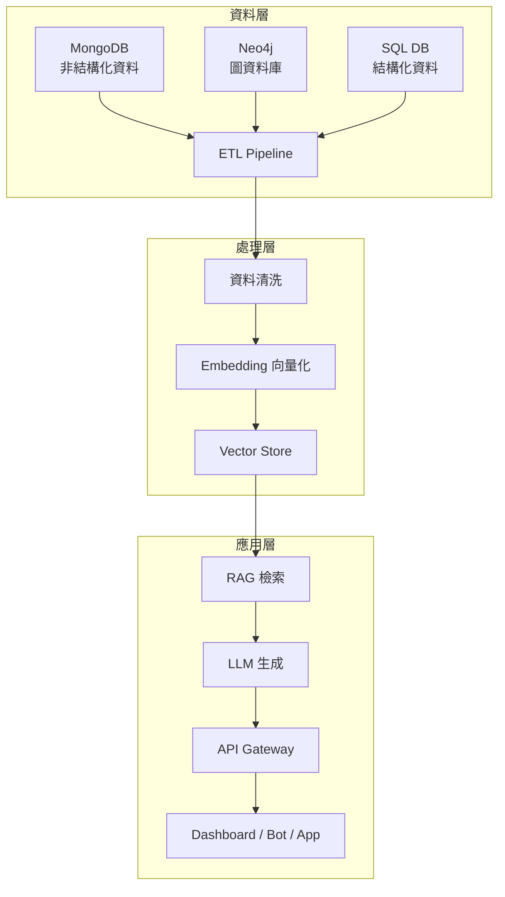

# 企業 AI 資料中臺

> tags: #Architecture #RAG #MLOps #todo

## 概述

<!-- 描述資料中臺的定位與目標 -->

## 架構圖

<!-- 插入或連結 07_Diagrams/ 中的架構圖 -->

## 核心元件

### 資料層
<!-- MongoDB / Neo4j / Vector DB -->

### 處理層
<!-- ETL / 資料清洗 / Embedding -->

### 應用層
<!-- RAG / API / Dashboard -->

## 技術選型

| 元件 | 技術方案 | 備註 |
|---|---|---|

## 設計考量

### 擴展性

### 安全性

### 效能

## 參考資料

- 
