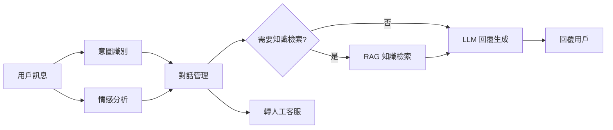

# 客服機器人架構

> tags: #Architecture #Agent #NLP #Sentiment #todo

## 概述

<!-- 結合情感分析與 LLM 的智能客服系統 -->

## 架構圖

## 核心模組

### 意圖識別
<!-- NLU 模組：辨識用戶意圖 -->

### 情感分析
<!-- 即時情緒偵測，觸發預警機制 -->

### 對話管理
<!-- 多輪對話狀態追蹤 -->

### 知識檢索 (RAG)
<!-- 企業知識庫 + 向量檢索 -->

### LLM 回覆生成
<!-- 使用 LLM 產生自然語言回覆 -->

## 技術選型

| 模組 | 技術方案 | 備註 |
|---|---|---|

## 品質指標

| 指標 | 目標值 | 衡量方式 |
|---|---|---|

## 參考資料

- 
