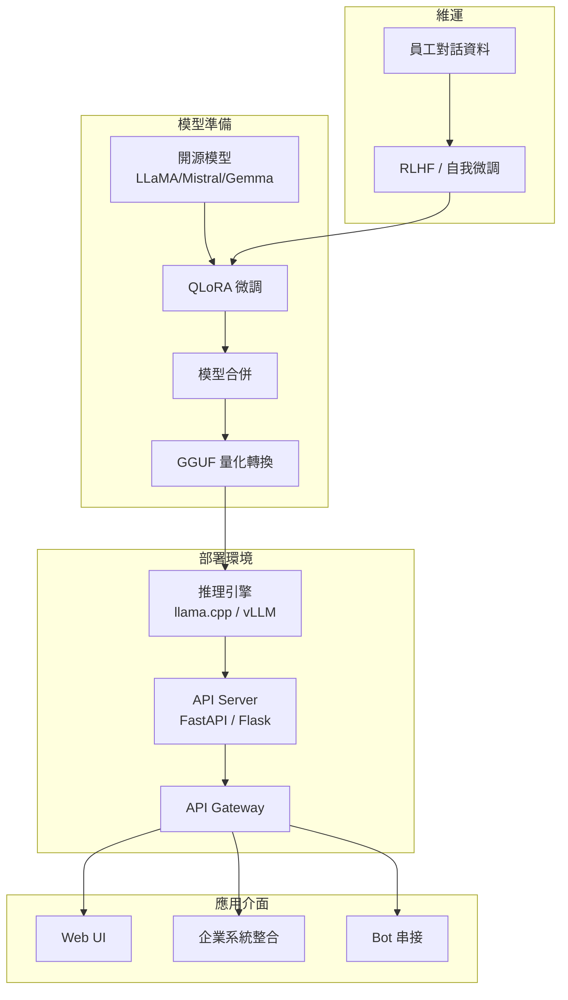

# 私有化 LLM 部署

> tags: #Architecture #LLM #MLOps #todo

## 概述

<!-- 將開源 LLM 部署至企業內部環境，確保資料安全 -->

## 架構圖

## 核心流程

### 模型選擇
<!-- LLaMA / Mistral / Gemma 比較 -->

| 模型 | 參數量 | 授權 | 中文能力 | 備註 |
|---|---|---|---|---|

### 模型微調 (QLoRA)
<!-- 企業語料 + QLoRA Fine-tuning -->

### 模型轉換與量化 (GGUF)
<!-- 轉換格式、量化等級選擇 -->

| 量化等級 | 模型大小 | 品質 | 適用場景 |
|---|---|---|---|

### 地端部署
<!-- 硬體需求、推理引擎選擇 -->

### API 與微服務
<!-- RESTful API 設計、負載均衡 -->

### 安全性與權限管理
<!-- 資料隔離、存取控制 -->

## 硬體需求

| 配置 | CPU 模式 | GPU 模式 |
|---|---|---|

## 成本估算

## 參考資料

- 
